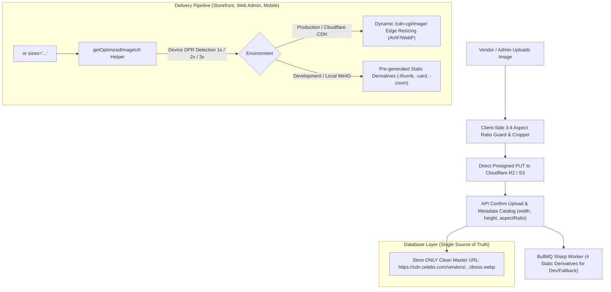

# RFC-003: SHEIN-Grade Apparel Image Pipeline & Responsive Delivery

**Status**: Proposed  
**Authors**: Celebs Core Engineering Team  
**Scope**: `packages/shared-utils`, `packages/shared-ui`, `apps/web-admin`, `apps/api`, `apps/mobile`, `apps/storefront`  
**Dependencies**: `RFC-001 (Multi-Vendor Media Management & Storage)`

---

## 1. Executive Summary & Problem Statement

In fashion e-commerce (SHEIN, Zara, ASOS, SSENSE), product imagery directly drives conversion. General marketplaces (e.g., Daraz) suffer from poor visual appeal due to unconstrained seller uploads: mixed square/landscape images, letterboxing, blurriness, and layout shifting.

Furthermore, hardcoding pixel dimensions (`360x480`, `q=80`) across screens is an anti-pattern that breaks responsive layouts, fails on high-density Retina/OLED displays (iPhone Pro, Galaxy Ultra), and wastes mobile bandwidth.

This document defines the **End-to-End Dynamic Fashion Image Pipeline** for `celebs`:

1. **Strict 3:4 Portrait Aspect Ratio Enforcement** at upload time.
2. **Canonical Master URL Storage**: Database & APIs store ONLY the master image URL without baked-in dimensions.
3. **Dynamic Semantic Presets & Auto `srcset`**: Components select semantic roles (`grid-card`, `pdp-hero`, `thumbnail`) while resolution, DPR, and formats are computed on the fly.
4. **Cloudflare CDN Edge Resizing (`/cdn-cgi/image/`)** with Sharp multi-derivative fallback for local development.
5. **Zero Cumulative Layout Shift (CLS = 0)** with Retina DPR (`1x`, `2x`, `3x`) delivery.
6. **Color Swatch Hover Swapping** on product catalog cards.

---

## 2. System Architecture Overview



---

## 3. Dimension, Aspect Ratio & Screen DPI Matrix

### 3.1. Standardized 3:4 Portrait Matrix

All apparel catalog images strictly conform to the **`3:4` vertical portrait ratio** (`0.75` aspect ratio).

### 3.2. Multi-DPI Resolution Tiers

Modern devices require distinct physical pixel densities to avoid blurry rendering on OLED/Retina screens:

| Context / Viewport          | 1x Standard Display (1080p) | 2x Retina (MacBook / iPad) | 3x Super Retina (iPhone Pro / OLED) | Quality | Fit Mode | Primary Codecs  |
| :-------------------------- | :-------------------------- | :------------------------- | :---------------------------------- | :------ | :------- | :-------------- |
| **Grid / Catalog Feed**     | `360 x 480 px` (~25 KB)     | `720 x 960 px` (~65 KB)    | `1080 x 1440 px` (~120 KB)          | `q=80`  | `cover`  | `AVIF` / `WebP` |
| **PDP Main Hero**           | `750 x 1000 px` (~80 KB)    | `1500 x 2000 px` (~180 KB) | `1500 x 2000 px` (~180 KB)          | `q=85`  | `inside` | `AVIF` / `WebP` |
| **PDP Hi-Res Zoom Modal**   | `1200 x 1600 px` (~150 KB)  | `1800 x 2400 px` (~280 KB) | `1800 x 2400 px` (~280 KB)          | `q=90`  | `inside` | `WebP`          |
| **Cart / Order Mini-Thumb** | `120 x 160 px` (~8 KB)      | `240 x 320 px` (~18 KB)    | `360 x 480 px` (~28 KB)             | `q=75`  | `cover`  | `WebP`          |
| **LQIP Blur Placeholder**   | `30 x 40 px` (< 1 KB)       | `30 x 40 px` (< 1 KB)      | `30 x 40 px` (< 1 KB)               | `q=60`  | `cover`  | Base64 Data URL |

---

## 4. Detailed Implementation Modules

### Module 1: Centralized Preset Registry & Dynamic URL Builder (`@celebs/shared-utils`)

**File:** `packages/shared-utils/src/utils/image-url.ts`

Centralizes all semantic presets and dynamically constructs Cloudflare Edge transformation URLs or static local dev paths:

```typescript
export const IMAGE_PRESETS = {
  thumbnail: { width: 120, height: 160, quality: 75, fit: 'cover' as const },
  'grid-card': { width: 360, height: 480, quality: 80, fit: 'cover' as const },
  'pdp-hero': { width: 750, height: 1000, quality: 85, fit: 'inside' as const },
  zoom: { width: 1500, height: 2000, quality: 90, fit: 'inside' as const },
  avatar: { width: 80, height: 80, quality: 80, fit: 'cover' as const },
} as const;

export type ImagePreset = keyof typeof IMAGE_PRESETS;

export interface ImageTransformOptions {
  preset?: ImagePreset;
  width?: number;
  height?: number;
  quality?: number;
  fit?: 'cover' | 'contain' | 'inside' | 'crop';
  format?: 'auto' | 'webp' | 'avif' | 'jpeg';
  dpr?: 1 | 2 | 3;
}

export function getOptimizedImageUrl(
  sourceUrl: string,
  options: ImageTransformOptions = {},
): string {
  if (!sourceUrl) return '';

  const presetConfig = options.preset ? IMAGE_PRESETS[options.preset] : null;

  const width = options.width ?? presetConfig?.width;
  const height = options.height ?? presetConfig?.height;
  const quality = options.quality ?? presetConfig?.quality ?? 80;
  const fit = options.fit ?? presetConfig?.fit ?? 'cover';
  const format = options.format ?? 'auto';
  const dpr = options.dpr ?? 1;

  // 1. Cloudflare CDN Edge Transformation (Production)
  const isCloudflare =
    sourceUrl.includes('cdn.celebs.com') || process.env.NEXT_PUBLIC_USE_CLOUDFLARE_IMAGE === 'true';

  if (isCloudflare) {
    const params: string[] = [];
    if (width) params.push(`width=${width * dpr}`);
    if (height) params.push(`height=${height * dpr}`);
    params.push(`quality=${quality}`);
    params.push(`fit=${fit}`);
    params.push(`format=${format}`);

    try {
      const urlObj = new URL(sourceUrl);
      return `${urlObj.origin}/cdn-cgi/image/${params.join(',')}${urlObj.pathname}`;
    } catch {
      return sourceUrl;
    }
  }

  // 2. Static Derivative Mapping (Development / MinIO Fallback)
  const effectiveWidth = (width || 360) * dpr;
  if (effectiveWidth <= 180) {
    return sourceUrl.replace(/\.webp$/, '-thumb.webp');
  }
  if (effectiveWidth <= 800) {
    return sourceUrl.replace(/\.webp$/, '-card.webp');
  }
  if (effectiveWidth > 800) {
    return sourceUrl.replace(/\.webp$/, '-zoom.webp');
  }

  return sourceUrl;
}

/**
 * Builds responsive srcset string supporting 1x, 2x, and 3x Retina DPRs.
 */
export function buildDprSrcSet(
  sourceUrl: string,
  options: Omit<ImageTransformOptions, 'dpr'> = {},
): string {
  return [1, 2, 3]
    .map(
      (dpr) => `${getOptimizedImageUrl(sourceUrl, { ...options, dpr: dpr as 1 | 2 | 3 })} ${dpr}x`,
    )
    .join(',\n    ');
}
```

---

### Module 2: Client-Side 3:4 Aspect Ratio Guard & Cropper (`apps/web-admin`)

**File:** `apps/web-admin/src/features/product/components/media-crop-dialog.tsx`

When a vendor or administrator uploads an apparel image:

1. Client inspects dimensions in browser memory: `ratio = img.width / img.height`.
2. If `ratio < 0.70` or `ratio > 0.80` (i.e., not within standard `3:4` bounds):
   - Launches interactive crop modal locking the viewport to `3:4`.
   - Uses HTML5 Canvas off-screen rendering to export high-res cropped WebP blob.
3. If resolution is below `1200 x 1600 px`, displays a visual warning that zoom clarity may be degraded.

---

### Module 3: Universal Zero-CLS `<ApparelImage />` Component (`@celebs/shared-ui`)

**File:** `packages/shared-ui/src/components/apparel-image.tsx`

Supports **both** semantic presets (`preset="grid-card"`) and viewport-relative responsive sizing (`sizes="..."`):

```tsx
import React, { useState } from 'react';
import {
  buildDprSrcSet,
  getOptimizedImageUrl,
  ImagePreset,
  IMAGE_PRESETS,
} from '@celebs/shared-utils';
import { cn } from '@/lib/utils';

export interface ApparelImageProps extends React.ImgHTMLAttributes<HTMLImageElement> {
  src: string;
  alt: string;
  preset?: ImagePreset;
  sizes?: string;
  priority?: boolean;
}

export const ApparelImage: React.FC<ApparelImageProps> = ({
  src,
  alt,
  preset = 'grid-card',
  sizes,
  priority = false,
  className,
  ...props
}) => {
  const [loaded, setLoaded] = useState(false);

  // If explicit sizes attribute is provided (e.g. "(max-width: 640px) 50vw, 25vw"),
  // generate width descriptors. Otherwise, generate 1x, 2x, 3x DPR srcset.
  const srcSet = sizes
    ? [180, 360, 540, 720, 1080, 1500]
        .map((w) => `${getOptimizedImageUrl(src, { width: w })} ${w}w`)
        .join(', ')
    : buildDprSrcSet(src, { preset });

  return (
    <div className="relative aspect-[3/4] w-full overflow-hidden rounded-md bg-muted/30">
       setLoaded(true)}
        className={cn(
          'h-full w-full object-cover transition-opacity duration-300',
          loaded ? 'opacity-100' : 'opacity-0',
          className,
        )}
        {...props}
      />
    </div>
  );
};
```

---

### Module 4: React Native Mobile Integration (`apps/mobile`)

**File:** `apps/mobile/src/components/apparel-image.tsx`

Mobile screens query device hardware metrics automatically via `PixelRatio`:

```tsx
import React from 'react';
import { Image, PixelRatio, StyleSheet, View } from 'react-native';
import { getOptimizedImageUrl, ImagePreset } from '@celebs/shared-utils';

interface MobileApparelImageProps {
  src: string;
  preset?: ImagePreset;
  style?: object;
}

export const MobileApparelImage: React.FC<MobileApparelImageProps> = ({
  src,
  preset = 'grid-card',
  style,
}) => {
  const dpr = Math.min(3, Math.ceil(PixelRatio.get())) as 1 | 2 | 3;
  const optimizedUrl = getOptimizedImageUrl(src, { preset, dpr });

  return (
    <View style={[styles.container, style]}>
      <Image source={{ uri: optimizedUrl }} style={styles.image} resizeMode="cover" />
    </View>
  );
};

const styles = StyleSheet.create({
  container: {
    aspectRatio: 3 / 4,
    backgroundColor: '#F3F4F6',
    borderRadius: 8,
    overflow: 'hidden',
  },
  image: {
    width: '100%',
    height: '100%',
  },
});
```

---

### Module 5: Color Swatch Swapping on Catalog Feeds

**File:** `apps/web-admin/src/features/product/components/product-feed-card.tsx`

```tsx
export const ProductFeedCard = ({ product }: { product: ProductWithVariants }) => {
  const [activeImage, setActiveImage] = useState(product.images[0]?.url);

  return (
    <div className="group flex flex-col">
      {/* 3:4 Responsive Main Image */}
      <ApparelImage src={activeImage} alt={product.title} preset="grid-card" />

      {/* Interactive Variant Color Pills */}
      <div className="mt-2 flex items-center gap-1.5">
        {product.colorVariants.map((variant) => (
          <button
            key={variant.id}
            onMouseEnter={() => variant.imageUrl && setActiveImage(variant.imageUrl)}
            onClick={() => variant.imageUrl && setActiveImage(variant.imageUrl)}
            className="h-3.5 w-3.5 rounded-full border border-border transition-transform hover:scale-125"
            style={{ backgroundColor: variant.colorHex }}
            title={variant.colorName}
          />
        ))}
      </div>
    </div>
  );
};
```

---

## 5. Implementation Milestones

| Milestone                                   | Deliverables                                                                      | Target Package / App             |
| :------------------------------------------ | :-------------------------------------------------------------------------------- | :------------------------------- |
| **Phase 1: Shared Preset & URL Engine**     | Add `IMAGE_PRESETS`, `getOptimizedImageUrl`, and `buildDprSrcSet` with unit tests | `packages/shared-utils`          |
| **Phase 2: Client 3:4 Uploader Guard**      | Add `3:4` validation inspection and interactive cropper in product add modal      | `apps/web-admin`                 |
| **Phase 3: Universal `<ApparelImage />`**   | Implement zero-CLS `<ApparelImage />` with `aspect-[3/4]`, `srcSet`, and blur-up  | `packages/shared-ui`             |
| **Phase 4: Mobile & Variant Interactivity** | Mobile React Native component + color swatch image switching on feed cards        | `apps/mobile` & `apps/web-admin` |
