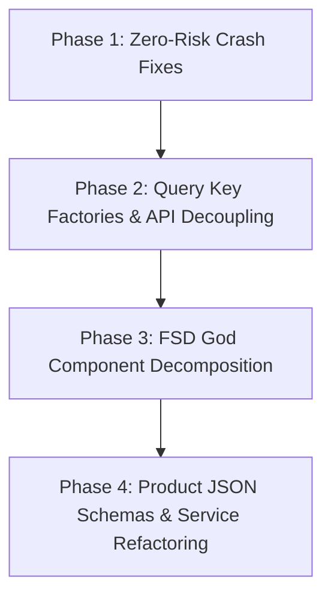

# Monorepo Architectural & Technical Debt Audit

**Document Reference**: `docs/audits/codebase-technical-debt-and-architecture-audit.md`  
**Date**: September 2026  
**Auditor**: Antigravity Assistant via `codebase-memory-mcp` Knowledge Graph (7,315 nodes, 28,876 edges)  
**Scope**: Full Monorepo — `apps/api` (24 modules), `apps/web-admin` (14 features), `apps/mobile` (11 features), `packages/shared-*`

---

## Executive Summary

A comprehensive, system-wide codebase analysis was conducted to uncover architectural deviations, high cyclomatic complexity, missing strict type contracts, and mandate non-compliance across the monorepo.

While core clean architecture principles are in place (e.g., zero direct Prisma queries in controllers, dedicated PgBouncer pool on port 6543, and strong auth guards), earlier development phases introduced **God Components** (up to 521 lines and CC 42), **dangerous non-null assertions** (leading to uncaught runtime errors), **JSON column double-casting**, and **hardcoded TanStack Query keys**.

This document serves as the permanent reference and blueprint for all remediation sprints.

---

## 1. Compliance Scorecard Against Mandates

| Pre-Flight Gate / Mandate                                                 |  Status  | Summary of Violations                                                                                                                           |
| :------------------------------------------------------------------------ | :------: | :---------------------------------------------------------------------------------------------------------------------------------------------- | ---- | ------------ |
| **Gate 1: Domain Scoping**                                                | **PASS** | Monorepo package boundaries and import paths generally respected.                                                                               |
| **Gate 2: File Budget & Complexity** (`.tsx` $\le$ 150 lines, CC $\le$ 8) | **FAIL** | **7 God Components** in Web-Admin and Mobile severely exceed 150 lines (up to 521 lines) and CC 8 (up to CC 42).                                |
| **Gate 3: Server State & Query Key Factories**                            | **WARN** | Inline `useQuery` calls and hardcoded string query keys found in 3 Web-Admin components; mobile `auth-context` calls `apiClient` directly.      |
| **Gate 4: Component Purity & HMR**                                        | **WARN** | Multiple `react-hooks/exhaustive-deps` ESLint disable directives create potential stale closure bugs.                                           |
| **Gate 5: Clean Architecture in API**                                     | **PASS** | Zero Prisma queries in controllers (all routed through Service $\to$ Repository).                                                               |
| **Gate 6: Strict Null Contracts & Existence Guarantees**                  | **FAIL** | Non-null assertions (`!`) on optional fields in production business logic, double-casting in payment adapters, and lax repository parameters (` | null | undefined`). |
| **REST Standard Verbs & Plural Nouns**                                    | **WARN** | Singular routes mounted in `app.ts` (`/quick-filter`, `/vendor`).                                                                               |

---

## 2. Detailed Catalog of Issues by Category

### 2.1 Monolithic God Components (.tsx > 150 Lines, CC > 8)

The following components violate Gate 2 of `.agents/AGENTS.md`:

| Component / Function             | File Path                                                                                                                                                                                                     |  Lines  |   CC   | Root Cause / Anti-Pattern                                                                                                                       |
| :------------------------------- | :------------------------------------------------------------------------------------------------------------------------------------------------------------------------------------------------------------ | :-----: | :----: | :---------------------------------------------------------------------------------------------------------------------------------------------- |
| **`SkuTableInputField`**         | [`apps/web-admin/src/features/product/fields/components/sku-table-input-field.tsx`](file:///c:/celebs/celebs/apps/web-admin/src/features/product/fields/components/sku-table-input-field.tsx)                 | **521** | **42** | Single monolithic component managing stock matrix generation, barcode sync, inline pricing validation, bulk apply actions, and table rendering. |
| **`LayoutEditorPage`**           | [`apps/web-admin/src/features/platform-settings/pages/layout-editor-page.tsx`](file:///c:/celebs/celebs/apps/web-admin/src/features/platform-settings/pages/layout-editor-page.tsx)                           | **529** | **12** | Monolithic page managing drag-and-drop hierarchy, component inspector, preview rendering, and server persistence.                               |
| **`ProductCard`** _(Mobile)_     | [`apps/mobile/src/features/products/components/product-card.tsx`](file:///c:/celebs/celebs/apps/mobile/src/features/products/components/product-card.tsx)                                                     | **412** | **16** | Mobile card component juggling swatch state, image gallery carousels, pricing math, wishlist mutations, and cart animations in one file.        |
| **`BannersPage`**                | [`apps/web-admin/src/features/platform-settings/pages/banners-page.tsx`](file:///c:/celebs/celebs/apps/web-admin/src/features/platform-settings/pages/banners-page.tsx)                                       | **405** | **10** | Table rendering, modal state, image upload, and reorder mutation in one page.                                                                   |
| **`OptionSetsPage`**             | [`apps/web-admin/src/features/option-sets/pages/option-sets-page.tsx`](file:///c:/celebs/celebs/apps/web-admin/src/features/option-sets/pages/option-sets-page.tsx)                                           | **346** | **12** | Option set master-detail management in one component.                                                                                           |
| **`SizeMeasurementsInputField`** | [`apps/web-admin/src/features/product/fields/components/size-measurements-input-field.tsx`](file:///c:/celebs/celebs/apps/web-admin/src/features/product/fields/components/size-measurements-input-field.tsx) | **338** | **18** | Large measurement matrix inputs without sub-component slicing.                                                                                  |
| **`ColorMetaItem`**              | [`apps/web-admin/src/features/product/fields/components/color-meta-input-field.tsx`](file:///c:/celebs/celebs/apps/web-admin/src/features/product/fields/components/color-meta-input-field.tsx)               | **332** | **25** | Color swatch picker, upload dropzone, and hex input merged into one file.                                                                       |
| **`DynamicProductForm`**         | [`apps/web-admin/src/features/product/components/dynamic-product-form.tsx`](file:///c:/celebs/celebs/apps/web-admin/src/features/product/components/dynamic-product-form.tsx)                                 | **331** | **24** | Dynamic form generator coordinating cascading dropdowns, sections, and validation in one closure.                                               |
| **`CategoryStorefrontTab`**      | [`apps/web-admin/src/features/category/components/category-storefront-tab.tsx`](file:///c:/celebs/celebs/apps/web-admin/src/features/category/components/category-storefront-tab.tsx)                         | **328** | **11** | Storefront visual layout and configuration tabs in one file.                                                                                    |
| **`AddProductFormBody`**         | [`apps/web-admin/src/features/product/components/add-product/index.tsx`](file:///c:/celebs/celebs/apps/web-admin/src/features/product/components/add-product/index.tsx)                                       | **306** | **12** | Product form orchestrator without extracted sub-panels.                                                                                         |

---

### 2.2 Monolithic Backend Service Methods (CC > 8)

| Class & Method                                         | File Path                                                                                                                                                                           |  Lines  |   CC   | Problem Description                                                                                                                                                                                               |
| :----------------------------------------------------- | :---------------------------------------------------------------------------------------------------------------------------------------------------------------------------------- | :-----: | :----: | :---------------------------------------------------------------------------------------------------------------------------------------------------------------------------------------------------------------- |
| **`CheckoutService.checkout`**                         | [`apps/api/src/modules/order/checkout/checkout.service.ts`](file:///c:/celebs/celebs/apps/api/src/modules/order/checkout/checkout.service.ts)                                       | **260** | **21** | God Method: Handles cart retrieval, multi-item reservation, voucher discount calculations, delivery fee computation, 1P vs 3P order splitting, and payment intent generation in a single interactive transaction. |
| **`ProductQueryService.applyScalarFilters`**           | [`apps/api/src/modules/product/product-query.service.ts`](file:///c:/celebs/celebs/apps/api/src/modules/product/product-query.service.ts)                                           | **68**  | **15** | Deep chained if-branches building raw Prisma SQL filtering conditions.                                                                                                                                            |
| **`PostgresInventoryRepository.syncProductInventory`** | [`apps/api/src/modules/product/repositories/postgres-inventory.repository.ts`](file:///c:/celebs/celebs/apps/api/src/modules/product/repositories/postgres-inventory.repository.ts) | **107** | **13** | Monolithic sync loop diffing variants, stock levels, and active status.                                                                                                                                           |
| **`CartService.syncCart`**                             | [`apps/api/src/modules/cart/cart.service.ts`](file:///c:/celebs/celebs/apps/api/src/modules/cart/cart.service.ts)                                                                   | **119** | **10** | Complex batch stock check and raw SQL unnest upsert.                                                                                                                                                              |
| **`PlatformSettingsService.validateSettingValue`**     | [`apps/api/src/modules/platform-settings/platform-settings.service.ts`](file:///c:/celebs/celebs/apps/api/src/modules/platform-settings/platform-settings.service.ts)               | **40**  | **10** | Switch-case type validator lacking schema composition.                                                                                                                                                            |
| **`KhaltiAdapter.verifyPayment`**                      | [`apps/api/src/modules/order/adapters/khalti.adapter.ts`](file:///c:/celebs/celebs/apps/api/src/modules/order/adapters/khalti.adapter.ts)                                           | **45**  | **9**  | Nested try/catch handling HTTP timeouts, response parsing, and error fallback.                                                                                                                                    |

---

### 2.3 Runtime Vulnerabilities & Dangerous Assertions

These are direct bugs or crash risks in production:

#### 1. Unchecked `!` on Optional Property (Category Service)

- **File**: [`apps/api/src/modules/category/category.service.ts:369`](file:///c:/celebs/celebs/apps/api/src/modules/category/category.service.ts#L369)
- **Code**:
  ```typescript
  // CategoryUpdateInput defines: name?: string
  // If an update does not include 'name', updateData.name is undefined:
  updateData.slug = slugify(updateData.name!, { lower: true, strict: true });
  ```
- **Consequence**: `slugify(undefined)` throws an unhandled `TypeError` in production when updating description or status without changing name.
- **Remediation**: Guard with `if (updateData.name) { updateData.slug = slugify(updateData.name, ...); }`.

#### 2. Unsafe Array Index + `!` on Mobile Product Screen

- **File**: [`apps/mobile/src/app/product/[id].tsx:91`](file:///c:/celebs/celebs/apps/mobile/src/app/product/%5Bid%5D.tsx#L91)
- **Code**:
  ```typescript
  product.colorVariants[selectedColorIndex].images!.length > 0;
  ```
- **Consequence**: If `colorVariants` is empty, or `selectedColorIndex` is out-of-bounds, or `images` is null, React Native crashes with a red-screen fatal exception.
- **Remediation**: Optional chaining: `Boolean(product.colorVariants?.[selectedColorIndex]?.images?.length)`.

#### 3. Unsafe `updatedRows[0]!` in Inventory Service

- **File**: [`apps/api/src/modules/inventory/inventory.service.ts:53`](file:///c:/celebs/celebs/apps/api/src/modules/inventory/inventory.service.ts#L53)
- **Code**:
  ```typescript
  if (!updatedRows || updatedRows.length === 0) {
    throw new OutOfStockError(...);
  }
  return updatedRows[0]!; // Forced non-null assertion
  ```
- **Remediation**:
  ```typescript
  const firstRow = updatedRows[0];
  if (!firstRow) {
    throw new OutOfStockError(...);
  }
  return firstRow;
  ```

#### 4. Repeated `req.inventoryId!` in Bulk Cart Operations

- **File**: [`apps/api/src/modules/cart/cart.service.ts:454, 465, 467`](file:///c:/celebs/celebs/apps/api/src/modules/cart/cart.service.ts#L454)
- **Code**: `req.inventoryId!` scattered across 3 lines in the batch merge loop.
- **Remediation**: Filter or validate `req.inventoryId` at the start of the function so the type narrows to strictly `string`.

---

### 2.4 Type Escapes, Casting, & Lax Parameter Typing

#### 1. Double-Casting (`as unknown as`) in Payment Adapters

- [`apps/api/src/modules/order/adapters/esewa.adapter.ts:64`](file:///c:/celebs/celebs/apps/api/src/modules/order/adapters/esewa.adapter.ts#L64):
  `const record = payload as unknown as Record<string, string>;`
- [`apps/api/src/modules/order/adapters/khalti.adapter.ts:107, 137`](file:///c:/celebs/celebs/apps/api/src/modules/order/adapters/khalti.adapter.ts#L107):
  `(data as unknown as { detail?: string }).detail`
- **Remediation**: Replace with Zod schema parsing: `const parsed = KhaltiErrorSchema.safeParse(data);`.

#### 2. PostgreSQL `JsonValue` Blind Casting (Product Module)

- PostgreSQL stores variant structures, measurements, and dynamic fields as JSON.
- Files affected:
  - [`apps/api/src/modules/product/product.presenter.ts`](file:///c:/celebs/celebs/apps/api/src/modules/product/product.presenter.ts#L27-L147): Over 15 instances of `(dynamicData as Record<string, unknown>)`, `(metaObj.images as unknown[])`.
  - [`apps/api/src/modules/product/utils/product-qc.ts`](file:///c:/celebs/celebs/apps/api/src/modules/product/utils/product-qc.ts#L47-L171): Over 8 instances of `productInput as Record<string, unknown>`.
  - [`apps/api/src/modules/product/product-assets.ts`](file:///c:/celebs/celebs/apps/api/src/modules/product/product-assets.ts#L27-L69): Over 5 instances of `source.mainImages as unknown[]`.
- **Remediation**: Provide reusable type guards (e.g., `isColorVariantArray(val)`, `parseProductMeasurements(val)`).

#### 3. Lax Parameter Signatures in Repositories

- **File**: [`apps/api/src/modules/media/media.repository.ts:314, 324`](file:///c:/celebs/celebs/apps/api/src/modules/media/media.repository.ts#L314)
- **Code**:
  ```typescript
  async createFolder(vendorId: string | null | undefined, name: string, parentId?: string | null)
  async updateFolder(id: string, vendorId: string | null | undefined, name: string)
  ```
- **Remediation**: Normalize signatures to strictly `vendorId?: string | null`.

---

### 2.5 Server State & TanStack Query Inconsistencies

#### 1. Hardcoded String Query Keys in UI Components

- [`apps/web-admin/src/features/marketing/components/product-selector.tsx:38`](file:///c:/celebs/celebs/apps/web-admin/src/features/marketing/components/product-selector.tsx#L38):
  `queryKey: ['products', 'selector', debouncedSearchTerm]`
- [`apps/web-admin/src/features/category/components/attribute-field-set.tsx:94, 129`](file:///c:/celebs/celebs/apps/web-admin/src/features/category/components/attribute-field-set.tsx#L94):
  `queryKey: ['option-sets']` and `queryKey: ['option-set-values', effectiveOptionSetId]`
- [`apps/web-admin/src/features/category/hooks/use-quick-filters.ts:15, 35, 46`](file:///c:/celebs/celebs/apps/web-admin/src/features/category/hooks/use-quick-filters.ts#L15):
  `queryKey: ['quick-filters', categoryId]` and `queryKey: ['category-tree']`
- **Remediation**: Define centralized Query Key factories:
  - `OPTION_SET_QUERY_KEYS = { all: ['option-sets'] as const, detail: (id: string) => ['option-sets', id] as const }`
  - `QUICK_FILTER_QUERY_KEYS = { byCategory: (catId: string) => ['quick-filters', catId] as const }`

#### 2. Direct `apiClient` Calls in Mobile React Context

- **File**: [`apps/mobile/src/features/auth/context/auth-context.tsx:57-103`](file:///c:/celebs/celebs/apps/mobile/src/features/auth/context/auth-context.tsx#L57-L103)
- **Code**:
  ```typescript
  await apiClient.post('/auth/google', data, { skipAuth: true });
  await apiClient.post('/auth/login', { email, password }, { skipAuth: true });
  await apiClient.post('/auth/logout').catch(() => {});
  ```
- **Remediation**: Extract into an `auth.api.ts` module with explicit input/output contracts.

---

### 2.6 React Hook Stale Closure Risks

- [`apps/web-admin/src/features/product/fields/components/color-meta-input-field.tsx:75`](file:///c:/celebs/celebs/apps/web-admin/src/features/product/fields/components/color-meta-input-field.tsx#L75):
  `// eslint-disable-next-line react-hooks/exhaustive-deps`
- [`apps/web-admin/src/features/product/fields/components/color-inline-input-field.tsx:58`](file:///c:/celebs/celebs/apps/web-admin/src/features/product/fields/components/color-inline-input-field.tsx#L58):
  `// eslint-disable-next-line react-hooks/exhaustive-deps`
- **Remediation**: Include missing dependencies or extract handlers outside `useEffect` using `useCallback`.

---

### 2.7 REST API Route Naming

In [`apps/api/src/app.ts:184-192`](file:///c:/celebs/celebs/apps/api/src/app.ts#L184-L192):

- Singular `/quick-filter` mounted instead of plural `/quick-filters`.
- Singular `/vendor` mounted instead of plural `/vendors`.
- Dual `/category` and `/categories` mounted simultaneously.
- **Remediation**: Standardize to plural `/quick-filters` and `/vendors`, keeping aliases strictly marked as deprecated if needed for legacy mobile builds.

---

## 3. Phased Remediation Roadmap



### Phase 1: High-Priority Safety & Crash Fixes (Immediate)

1. Fix [`category.service.ts:369`](file:///c:/celebs/celebs/apps/api/src/modules/category/category.service.ts#L369) slug generation guard.
2. Fix [`apps/mobile/src/app/product/[id].tsx:91`](file:///c:/celebs/celebs/apps/mobile/src/app/product/%5Bid%5D.tsx#L91) variant image array bounds check.
3. Fix [`inventory.service.ts:53`](file:///c:/celebs/celebs/apps/api/src/modules/inventory/inventory.service.ts#L53) with explicit assertion guard (`updatedRows[0]`).
4. Replace `as unknown as` in [`esewa.adapter.ts`](file:///c:/celebs/celebs/apps/api/src/modules/order/adapters/esewa.adapter.ts) and [`khalti.adapter.ts`](file:///c:/celebs/celebs/apps/api/src/modules/order/adapters/khalti.adapter.ts) with safe Zod parsing.
5. Add payment assertion guard in [`payment.service.ts:160`](file:///c:/celebs/celebs/apps/api/src/modules/order/payment/payment.service.ts#L160).

### Phase 2: Architecture & Server State Hygiene

1. Create `OPTION_SET_QUERY_KEYS` and `QUICK_FILTER_QUERY_KEYS`.
2. Replace hardcoded query keys in `product-selector.tsx`, `attribute-field-set.tsx`, and `use-quick-filters.ts`.
3. Move `apiClient` calls in mobile `auth-context.tsx` to `auth.api.ts`.
4. Fix the 2 `react-hooks/exhaustive-deps` warnings in color input fields.
5. Clean up `MediaRepository.createFolder` parameter signatures.

### Phase 3: FSD Decomposition of God Components

1. **`SkuTableInputField` (521 lines, CC 42)**:
   - Extract `SkuTableHeader.tsx`
   - Extract `SkuTableRow.tsx`
   - Extract `SkuBulkActions.tsx`
   - Extract table matrix generator to pure `sku-matrix.util.ts`
2. **`ProductCard` Mobile (412 lines, CC 16)**:
   - Extract `ProductCardSwatch.tsx`
   - Extract `ProductCardPricing.tsx`
   - Extract `ProductCardImageCarousel.tsx`
3. **`LayoutEditorPage` (529 lines, CC 12)**:
   - Extract `LayoutEditorCanvas.tsx`
   - Extract `LayoutEditorInspector.tsx`
   - Extract `LayoutEditorToolbar.tsx`

### Phase 4: Product JSON Schemas & Backend Orchestration

1. Create strongly typed Zod/TypeScript guards for `Product.dynamicData` and `Product.colorVariants`.
2. Clean up `product.presenter.ts`, `product-qc.ts`, and `product-assets.ts`.
3. Decompose `CheckoutService.checkout` into dedicated sub-services:
   - `OrderReservationService`
   - `OrderPricingCalculator`
   - `OrderFulfillmentSplitter`

---

## 5. API Response Standardization Matrix (API vs Mobile vs Web-Admin)

### 5.1 The Canonical Monorepo Contract

Defined in [`packages/shared-types/src/types/api.ts`](file:///c:/celebs/celebs/packages/shared-types/src/types/api.ts) and [`apps/api/src/common/utils/response.util.ts`](file:///c:/celebs/celebs/apps/api/src/common/utils/response.util.ts):

```typescript
export interface IApiResponse<T = unknown> {
  success: boolean;
  message: string;
  data: T | null;
  errorCode?: unknown;
  errors?: unknown[];
  requestId?: string;
  timestamp?: string;
}
```

### 5.2 Controller Response Implementation Audit (24 Modules)

| Controller                   | File Path                                                                                                                            | Envelope Status  | Primary Anti-Pattern / Defect                                                                                                                                                         |
| :--------------------------- | :----------------------------------------------------------------------------------------------------------------------------------- | :--------------: | :------------------------------------------------------------------------------------------------------------------------------------------------------------------------------------ |
| `CartController`             | [`cart.controller.ts`](file:///c:/celebs/celebs/apps/api/src/modules/cart/cart.controller.ts)                                        |    **BROKEN**    | Returns `{ message, data }` — **`success: true` is completely missing**. Breaks standard response guards.                                                                             |
| `MediaController`            | [`media.controller.ts`](file:///c:/celebs/celebs/apps/api/src/modules/media/media.controller.ts)                                     |    **BROKEN**    | Returns `{ success: true, data }` — **`message` is completely missing** in `getAssets`, `createFolder`, `presign`.                                                                    |
| `QuickFilterController`      | [`quick-filter.controller.ts`](file:///c:/celebs/celebs/apps/api/src/modules/quick-filter/quick-filter.controller.ts)                | **INCONSISTENT** | `getQuickFiltersForCategory` returns `{ success: true, data }` without `message`; `delete` returns `{ success: true, message }` without `data: null`.                                 |
| `ProductController`          | [`product.controller.ts`](file:///c:/celebs/celebs/apps/api/src/modules/product/product.controller.ts)                               | **NON-STANDARD** | Manually constructs inline object `{ success: true, message, data }`; omits `requestId` and `timestamp`. Pagination returns `{ data: { products, total, page, limit, totalPages } }`. |
| `CategoryController`         | [`category.controller.ts`](file:///c:/celebs/celebs/apps/api/src/modules/category/category.controller.ts)                            | **NON-STANDARD** | Manually constructs inline object; omits `requestId` and `timestamp`. Pagination returns `{ data: { categories, total, page, limit, pages } }` (`pages` instead of `totalPages`).     |
| `BrandController`            | [`brand.controller.ts`](file:///c:/celebs/celebs/apps/api/src/modules/brand/brand.controller.ts)                                     | **NON-STANDARD** | Manually constructs inline object; omits `requestId` and `timestamp`. Pagination returns `{ data: { items, total, page, limit, pages } }`.                                            |
| `VendorController`           | [`vendor.controller.ts`](file:///c:/celebs/celebs/apps/api/src/modules/vendor/vendor.controller.ts)                                  | **NON-STANDARD** | Manually constructs inline object; omits `requestId` and `timestamp`.                                                                                                                 |
| `UserController`             | [`user.controller.ts`](file:///c:/celebs/celebs/apps/api/src/modules/user/user.controller.ts)                                        | **NON-STANDARD** | Manually constructs inline object; omits `requestId` and `timestamp`.                                                                                                                 |
| `AuthController`             | [`auth.controller.ts`](file:///c:/celebs/celebs/apps/api/src/modules/auth/auth.controller.ts)                                        | **NON-STANDARD** | Manually constructs inline object in all 10 auth endpoints; omits `requestId` and `timestamp`.                                                                                        |
| `SessionController`          | [`session.controller.ts`](file:///c:/celebs/celebs/apps/api/src/modules/session/session.controller.ts)                               | **NON-STANDARD** | Manually constructs inline object; omits `requestId` and `timestamp`.                                                                                                                 |
| `BannerController`           | [`banner.controller.ts`](file:///c:/celebs/celebs/apps/api/src/modules/banner/banner.controller.ts)                                  | **NON-STANDARD** | Manually constructs inline object; omits `requestId` and `timestamp`.                                                                                                                 |
| `CampaignController`         | [`campaign.controller.ts`](file:///c:/celebs/celebs/apps/api/src/modules/campaign/campaign.controller.ts)                            | **NON-STANDARD** | Manually constructs inline object; omits `requestId` and `timestamp`.                                                                                                                 |
| `ComboController`            | [`combo.controller.ts`](file:///c:/celebs/celebs/apps/api/src/modules/combo/combo.controller.ts)                                     | **NON-STANDARD** | Manually constructs inline object; omits `requestId` and `timestamp`.                                                                                                                 |
| `OptionSetController`        | [`option-set.controller.ts`](file:///c:/celebs/celebs/apps/api/src/modules/option-set/option-set.controller.ts)                      | **NON-STANDARD** | Manually constructs inline object; omits `requestId` and `timestamp`.                                                                                                                 |
| `StaffController`            | [`staff.controller.ts`](file:///c:/celebs/celebs/apps/api/src/modules/staff/staff.controller.ts)                                     | **NON-STANDARD** | Manually constructs inline object; omits `requestId` and `timestamp`.                                                                                                                 |
| `AdminController`            | [`admin.controller.ts`](file:///c:/celebs/celebs/apps/api/src/modules/admin/admin.controller.ts)                                     | **NON-STANDARD** | Manually constructs inline object; omits `requestId` and `timestamp`.                                                                                                                 |
| `LogisticsController`        | [`logistics.controller.ts`](file:///c:/celebs/celebs/apps/api/src/modules/logistics/logistics.controller.ts)                         | **NON-STANDARD** | Manually constructs inline object; omits `requestId` and `timestamp`.                                                                                                                 |
| `PlatformSettingsController` | [`platform-settings.controller.ts`](file:///c:/celebs/celebs/apps/api/src/modules/platform-settings/platform-settings.controller.ts) | **NON-STANDARD** | Manually constructs inline object; omits `requestId` and `timestamp`.                                                                                                                 |
| `WishlistController`         | [`wishlist.controller.ts`](file:///c:/celebs/celebs/apps/api/src/modules/wishlist/wishlist.controller.ts)                            |  **CANONICAL**   | Uses `sendSuccess()` and `sendCreated()`. Correctly injects `requestId` & `timestamp`.                                                                                                |
| `CoreOrderController`        | [`order.controller.ts`](file:///c:/celebs/celebs/apps/api/src/modules/order/core/order.controller.ts)                                |  **CANONICAL**   | Uses `sendSuccess()`.                                                                                                                                                                 |
| `OrderPaymentController`     | [`payment.controller.ts`](file:///c:/celebs/celebs/apps/api/src/modules/order/payment/payment.controller.ts)                         |  **CANONICAL**   | Uses `sendSuccess()`.                                                                                                                                                                 |
| `OrderFulfillmentController` | [`fulfillment.controller.ts`](file:///c:/celebs/celebs/apps/api/src/modules/order/fulfillment/fulfillment.controller.ts)             |  **CANONICAL**   | Uses `sendSuccess()`.                                                                                                                                                                 |
| `OrderAddressController`     | [`address.controller.ts`](file:///c:/celebs/celebs/apps/api/src/modules/order/address/address.controller.ts)                         |  **CANONICAL**   | Uses `sendSuccess()` and `sendCreated()`.                                                                                                                                             |
| `CheckoutController`         | [`checkout.controller.ts`](file:///c:/celebs/celebs/apps/api/src/modules/order/checkout/checkout.controller.ts)                      |  **CANONICAL**   | Uses `sendCreated()`.                                                                                                                                                                 |

---

### 5.3 Client Consumption Discrepancies

#### A. Web-Admin Axios Client Return Contract Inconsistency

In `apps/web-admin/src/features/`:

1. **Raw AxiosResponse returned on mutations** (Leak):
   - In `vendors/api.ts`: `approveVendor`, `rejectVendor`, `suspendVendor` do `return await axiosClient.patch(...)` &rarr; returns `{ data, status, headers, config }` instead of payload!
   - In `vendor-onboarding/api.ts`: `updateVendorProfile`, `updateVendorWarehouse`, `updateVendorDocuments`, `submitVendorForReview` all return raw `AxiosResponse`.
   - In `staff/api.ts`: `createStaff`, `deleteStaff`, `updateStaff` return raw `AxiosResponse`.
   - In `users/api.ts`: `createUser`, `deleteUser` return raw `AxiosResponse`.
   - In `auth/api.ts`: `login`, `register`, `verifyEmail` return raw `AxiosResponse`.
2. **Double/Triple-unwrapped data** (Envelope bypass & fragmentation):
   - In `use-product-schema.ts:70`: Knowledge graph uncovered direct call to `/product-render` with **triple-nested fallback**: `response.data?.data?.data ?? response.data?.data ?? []`.
   - In `option-sets/api.ts`: `fetchOptionSets()`, `fetchOptionSetById()`, `createOptionSet()` return `res.data?.data`.
   - In `platform-settings/api.ts`: `getBanners()`, `updateBanners()` return `response.data?.data`.
3. **Single-unwrapped envelope** (Standard):
   - In `product/api.ts`, `orders/api.ts`, `category/api.ts`, `brand/api.ts`, `media-api.ts`: return `response.data` (`IApiResponse<T>`). Callers inspect `.data`.

#### B. Mobile Client Defensive Hacks & Fragile Handlers

In `apps/mobile/src/features/`:

1. **Direct `apiClient` in Hook**:
   - In `features/sdui/hooks/use-sdui-layout.ts`: Directly calls `apiClient.get('/settings/public')` inside `useQuery` queryFn, violating the mandate that all network calls must be isolated in feature-level `api.ts` modules.
2. **Triple-fallback array checks**:
   - In `products/hooks/use-products.ts:58-61`:
     ```typescript
     if (Array.isArray(page?.data?.products)) return page.data.products;
     if (Array.isArray(page?.data)) return page.data;
     if (Array.isArray(page?.products)) return page.products;
     ```
     Root cause: Inconsistent typing between `apiClient.get` and controller pagination envelope.
3. **Custom Cart response wrapper**:
   - In `cart/services/cart-service.ts`: Handlers explicitly declare `apiClient.get<{ message: string; data: CartResponse }>` because `CartController` fails to provide `success: true`.

#### C. REST Route Verb Anti-Patterns (Graph-Verified)

Discovered via `MATCH (r:Route)` in `codebase-memory-mcp`:

- `POST /:id/archive` in [`product.controller.ts:240`](file:///c:/celebs/celebs/apps/api/src/modules/product/product.controller.ts#L240) (Action verb in path; should be `DELETE /:id`).
- `POST /:id/toggle-activation` in [`product.controller.ts`](file:///c:/celebs/celebs/apps/api/src/modules/product/product.controller.ts) (Action verb in path; should be `PATCH /:id`).
- `/campaigns/all` and `/campaigns/id/:id` in [`marketing/api.ts`](file:///c:/celebs/celebs/apps/web-admin/src/features/marketing/api.ts) (Action verbs and non-REST paths).

---

## 6. Database & Prisma ORM Anti-Patterns

### 6.1 Missing Database Indexes (`apps/api/src/db/schema.prisma`)

| Model               | Missing Index                                                          | Affected Endpoints / Operations                                          | Performance Impact                                                                           |
| :------------------ | :--------------------------------------------------------------------- | :----------------------------------------------------------------------- | :------------------------------------------------------------------------------------------- |
| **`VendorProfile`** | `@@index([status])`                                                    | `GET /api/v1/admin/vendors` (filtered by status e.g. `PENDING`)          | **Full table scan** on vendor admin management.                                              |
| **`QuickFilter`**   | `@@index([categoryId])`                                                | `GET /api/v1/quick-filters/category/:categoryId`                         | **Full table scan** on category storefront load.                                             |
| **`Review`**        | `@@index([productId, status])`                                         | `GET /api/v1/products/:id` (loads approved reviews)                      | **Full index scan + filter**; slow product detail load.                                      |
| **`CartItem`**      | `@@index([inventoryId])`                                               | Foreign key checks & cart item stock validations                         | **Sequential scan** during checkout and stock updates (only `[cartId, inventoryId]` exists). |
| **`OrderItem`**     | `@@index([vendorId, itemStatus])` and `@@index([vendorId, createdAt])` | `GET /api/v1/orders/vendor/orders` (vendor dashboard)                    | **Filesort & sequential scans** across vendor order items.                                   |
| **`Product`**       | Redundant `@@index([slug])`                                            | `slug` already has `@unique` which creates a B-tree index in PostgreSQL. | **Double index write overhead** on every product insert/update.                              |

### 6.2 Sequential Loop Queries & Concurrency Deadlocks

#### 1. Unsorted Row Locking Deadlocks (PostgreSQL 40P01)

- **File**: [`apps/api/src/modules/order/checkout/checkout.repository.ts:84-93`](file:///c:/celebs/celebs/apps/api/src/modules/order/checkout/checkout.repository.ts#L84)
- **Problem**:
  ```typescript
  // Unsorted items iterate and lock rows in user-supplied cart order
  for (const item of data.items) {
    await tx.$executeRaw`
      UPDATE "ProductInventory"
      SET reserved_quantity = reserved_quantity + ${item.quantity}
      WHERE id = ${item.inventoryId} ...`;
  }
  ```
  If Customer 1 checks out `[Inventory A, Inventory B]` while Customer 2 checks out `[Inventory B, Inventory A]`, the two interactive transactions take opposing row locks and trigger a **deadlock (`40P01`)**.
- **Remediation**:
  Enforce deterministic row locking order before transaction entry:
  ```typescript
  const sortedItems = [...data.items].sort((a, b) => a.inventoryId.localeCompare(b.inventoryId));
  ```

#### 2. Sequential Round Trips Inside Interactive Transactions

- **File**: [`apps/api/src/modules/banner/banner.repository.ts:39-44`](file:///c:/celebs/celebs/apps/api/src/modules/banner/banner.repository.ts#L39)
  Executes `for (const b of bannersData) { await tx.banner.create(...) }` inside `$transaction`. Replaced with atomic `tx.banner.createMany({ data: bannersData })`.
- **File**: [`apps/api/src/modules/product/repositories/postgres-inventory.repository.ts:176-206`](file:///c:/celebs/celebs/apps/api/src/modules/product/repositories/postgres-inventory.repository.ts#L176)
  Nested loops execute 30+ sequential `upsertInventoryRecord` queries inside an open transaction.
- **File**: [`apps/api/src/modules/order/core/order.repository.ts:149-158`](file:///c:/celebs/celebs/apps/api/src/modules/order/core/order.repository.ts#L149)
  Sequential `update` loop on cancellation instead of sorted locks or batch update.

---

## 7. Supabase PgBouncer (Port 6543) Connection Pooling Standards

1. **Transaction Hold Time**:
   In PgBouncer **Transaction Mode** (port 6543), a physical server connection is checked out exclusively for the duration of `prisma.$transaction(async (tx) => { ... })`. Any slow query or sequential network hop holds that physical connection. Batching loops into single round trips directly prevents pool exhaustion.
2. **Interactive Transaction Timeout**:
   Transactions must specify explicit timeout boundaries:
   ```typescript
   prisma.$transaction(async (tx) => { ... }, { maxWait: 5000, timeout: 10000 });
   ```

---

## 8. BullMQ & Redis Architecture & Performance Standards

### 8.1 Redis TCP Connection Multiplication

- **File**: [`apps/api/src/common/services/queue.service.ts:14-19`](file:///c:/celebs/celebs/apps/api/src/common/services/queue.service.ts#L14)
- **Problem**: Passing a raw connection object `{ host, port, password }` causes BullMQ to instantiate separate IORedis instances per Queue (4 queues = 4 connections) and 3 per Worker (4 workers = 12 connections), consuming **16+ TCP connections**.
- **Remediation**: Use a shared IORedis instance factory or dedicated connection instance with `maxRetriesPerRequest: null`.

### 8.2 Worker vs Server Graceful Shutdown

- `worker-main.ts` correctly closes all workers and queues upon `SIGTERM`/`SIGINT`.
- `main.ts` closes the HTTP server and Prisma pool, but must also close the queues instantiated for job dispatch (`mailQueue`, `assetQueue`).

---

## 9. Clean Architecture Service Layering Leaks

1. **`InventoryService`** ([`apps/api/src/modules/inventory/inventory.service.ts`](file:///c:/celebs/celebs/apps/api/src/modules/inventory/inventory.service.ts)):
   - **Violation**: Has no repository file. Directly imports `prisma from '@/config/db.prisma'` and runs raw SQL `$queryRaw` and `findUnique`.
   - **Remediation**: Extract all database operations into `inventory.repository.ts`.
2. **`ProductService`, `ProductQueryService`, `ProductLifecycleService`**:
   - **Violation**: No `ProductRepository` exists (`postgres-inventory.repository.ts` handles inventory only). Direct queries (`prisma.product.findMany`, `count`, `update`, `$transaction`) run inside the service classes.
   - **Remediation**: Create `postgres-product.repository.ts` and encapsulate all product CRUD and lifecycle transactions.
3. **`StoreLifecycleService`** ([`apps/api/src/modules/store/store-lifecycle.service.ts`](file:///c:/celebs/celebs/apps/api/src/modules/store/store-lifecycle.service.ts)):
   - **Violation**: Directly calls `prisma.vendorProfile.findUnique` and `updateMany`.
   - **Remediation**: Move vendor profile status queries and CAS updates to `vendor.repository.ts`.
4. **`WishlistService`** ([`apps/api/src/modules/wishlist/wishlist.service.ts:87`](file:///c:/celebs/celebs/apps/api/src/modules/wishlist/wishlist.service.ts#L87)):
   - **Violation**: Directly calls `prisma.product.findUnique({ where: { id: productId } })`.
   - **Remediation**: Route product existence check through `wishlist.repository.ts` or `product.repository.ts`.
5. **Dangling Dead Prisma Imports**:
   - `auth.service.ts:34`, `cart.service.ts:10`, and `schema-composer.ts:3` import `prisma from '@/config/db.prisma'` but never invoke it (orphaned imports from previous refactorings).

---

## 10. How to Audit with Codebase Memory MCP

To verify compliance in future sessions, run these Cypher queries via `query_graph`:

```cypher
// 1. Find functions violating CC > 8
MATCH (fn:Function) WHERE fn.complexity > 8
RETURN fn.name, fn.file_path, fn.complexity, fn.lines
ORDER BY fn.complexity DESC LIMIT 25;

// 2. Find methods violating CC > 8
MATCH (m:Method) WHERE m.complexity > 8
RETURN m.name, m.parent_class, m.file_path, m.complexity, m.lines
ORDER BY m.complexity DESC LIMIT 25;

// 3. Find UI components with high line counts
MATCH (fn:Function)
WHERE fn.file_path ENDS WITH '.tsx' AND fn.lines > 150
RETURN fn.name, fn.file_path, fn.lines, fn.complexity
ORDER BY fn.lines DESC LIMIT 25;
```
