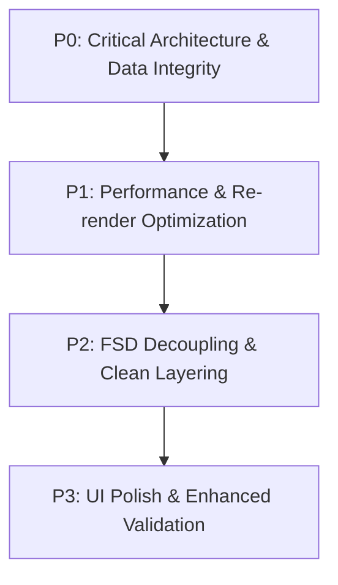
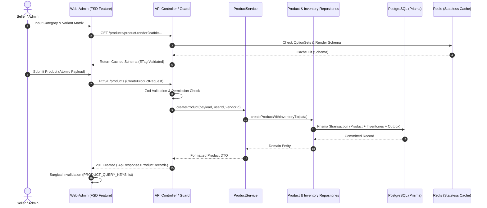

# Senior Fullstack & Solution Architect Product Feature Audit

**Target Applications & Modules:**

- **Backend API**: [`apps/api/src/modules/product`](file:///c:/celebs/celebs/apps/api/src/modules/product)
- **Frontend Web-Admin**: [`apps/web-admin/src/features/product`](file:///c:/celebs/celebs/apps/web-admin/src/features/product)
- **Shared Contracts**: [`packages/shared-types`](file:///c:/celebs/celebs/packages/shared-types)

---

## 1. Executive Summary & Architecture Scorecard

```
┌─────────────────────────────────────────────────────────────────────────────────────────────────┐
│                                ARCHITECTURE HEALTH OVERVIEW                                     │
├──────────────────────────────┬────────┬──────────────┬──────────────────────────────────────────┤
│ Domain                       │ Score  │ Status       │ Key Observations                         │
├──────────────────────────────┼────────┼──────────────┼──────────────────────────────────────────┤
│ Backend Layer Isolation      │ 7.0/10 │ ⚠️ Warning   │ Repository bypassed; direct Prisma ORM   │
│ Concurrency & Transactions   │ 8.0/10 │ 🟢 Good      │ Atomic Prisma Tx, but slug race & orphan │
│ Frontend FSD Compliance      │ 6.5/10 │ ❌ Violation │ Direct cross-feature imports (category)  │
│ Frontend Render Performance  │ 6.0/10 │ ⚠️ Warning   │ Global form watch triggers on keystroke  │
│ Type Safety & Contracts      │ 7.5/10 │ 🟡 Moderate  │ Duplicate types; double-cast escape hats │
│ Test Coverage & Quality      │ 7.0/10 │ 🟡 Moderate  │ Missing tenant isolation & matrix specs  │
└──────────────────────────────┴────────┴──────────────┴──────────────────────────────────────────┘
```

### Key Architectural Strengths

1. **Prisma Transaction Boundaries**: Product creation and update operations in [`ProductService`](file:///c:/celebs/celebs/apps/api/src/modules/product/product.service.ts) are grouped inside `prisma.$transaction(async (tx) => { ... })`, maintaining atomicity between the `Product` document entity and `ProductInventory` SQL rows.
2. **Dynamic Schema-Driven UI Pipeline**: The category-driven field resolution in [`schema-composer.ts`](file:///c:/celebs/celebs/apps/api/src/modules/product/schema-composer.ts) and [`dynamic-product-form.tsx`](file:///c:/celebs/celebs/apps/web-admin/src/features/product/components/dynamic-product-form.tsx) allows flexible catalog schemas without schema migrations.
3. **Structured Moderation & QC Engine**: The Daraz/SHEIN-style QC rating station in [`product-qc.ts`](file:///c:/celebs/celebs/apps/api/src/modules/product/utils/product-qc.ts) and [`review-queue`](file:///c:/celebs/celebs/apps/web-admin/src/features/product/components/review-queue) provides automated scoring and structured feedback loops to vendors.

---

## 2. Backend API Architecture Audit (`apps/api/src/modules/product`)

### 2.1 Layer Separation & Code Cleanliness

```
Current Flow (Direct ORM coupling):
[product.routes.ts] ──> [product.controller.ts] ──> [product.service.ts] ──(Direct Prisma Calls)──> [PostgreSQL]
                                                               └── (Bypasses PostgresInventoryRepository!)
```

#### [Issue 1] Bypassed Repository Abstraction & Dead Code

- **Location**: [`apps/api/src/modules/product/repositories/postgres-inventory.repository.ts`](file:///c:/celebs/celebs/apps/api/src/modules/product/repositories/postgres-inventory.repository.ts)
- **Details**: `PostgresInventoryRepository` was created with methods like `createInventoryRecord`, `repairMissingInventoryRecord`, etc., but [`product.service.ts`](file:///c:/celebs/celebs/apps/api/src/modules/product/product.service.ts) completely ignores it and runs raw ORM queries (`tx.productInventory.upsert`).
- **Violation**: Violates Monorepo Mandate Rule 3 (_"Repositories: Direct access to underlying data layers through ORM singletons"_).
- **Remediation**:
  Extract database queries into a `ProductRepository` and `InventoryRepository`. Inject these repositories into `ProductService`.

#### [Issue 2] Double-Casting Escape Hatches (`as unknown as Record<string, unknown>`)

- **Location**: [`product.service.ts:L391`](file:///c:/celebs/celebs/apps/api/src/modules/product/product.service.ts#L391), [`L522`](file:///c:/celebs/celebs/apps/api/src/modules/product/product.service.ts#L522), [`L540`](file:///c:/celebs/celebs/apps/api/src/modules/product/product.service.ts#L540)
- **Details**:
  ```typescript
  // ❌ Current code
  products.map((p) => this.formatProductResponse(p as unknown as Record<string, unknown>));
  ```
- **Violation**: Violates Monorepo Mandate Rule 5 & 8 (_"Avoid unsafe double-cast escape hatches (`as unknown as Record<string, unknown>`)"_).
- **Remediation**: Use Prisma's strongly typed payload helper:
  ```typescript
  export type ProductWithRelations = Prisma.ProductGetPayload<{
    include: {
      category: { select: { id: true; name: true; slug: true; path: true; level: true } };
      subcategory: { select: { id: true; name: true; slug: true; path: true; level: true } };
    };
  }>;
  ```

#### [Issue 3] Dead / Redundant Service Methods

- **Location**: `getProductsByVendor` in [`product.service.ts:L213-L267`](file:///c:/celebs/celebs/apps/api/src/modules/product/product.service.ts#L213-L267)
- **Details**: `getAllProducts` already handles vendor-scoped queries with pagination, cursor support, tag search, and category tree queries. `getProductsByVendor` is redundant and uncalled by any controller.

---

### 2.2 Business Logic, Concurrency & Data Integrity

#### [Issue 4] Ghost Inventory Records on Variant Modification (Data Integrity Bug)

- **Location**: [`product.service.ts:L61-L137`](file:///c:/celebs/celebs/apps/api/src/modules/product/product.service.ts#L61-L137) (`syncProductInventory`)
- **Problem**: When a vendor updates a product and removes a color variant or size (e.g. drops "Color: Red"), `syncProductInventory` only executes `tx.productInventory.upsert(...)` for active incoming variants. It **never prunes or zeroes out removed variants**.
- **Business Impact**: Old SKUs remain active in `ProductInventory` with their old quantities. Customers can still add these deleted SKUs to their cart via `CartItem` -> `inventoryId`.
- **Remediation**:
  Inside the update transaction, compute the diff of active SKUs vs database SKUs:
  ```typescript
  const activeSkus = Array.from(seenSkus);
  await tx.productInventory.deleteMany({
    where: {
      productId,
      sku: { notIn: activeSkus },
      orderItems: { none: {} }, // Guard against deleting inventory tied to historic orders
    },
  });
  ```

#### [Issue 5] Slug Generation Concurrency Race Condition

- **Location**: [`product.service.ts:L827-L838`](file:///c:/celebs/celebs/apps/api/src/modules/product/product.service.ts#L827-L838) (`generateUniqueSlug`)
- **Problem**:
  ```typescript
  while (await prisma.product.findUnique({ where: { slug } })) {
    attempt += 1;
    slug = `${base}-${Date.now()}-${attempt}`;
  }
  ```
  The uniqueness check occurs **outside** the transaction. If two vendors create items with the exact same name at the exact same millisecond, both pass the check and the transaction aborts with a `P2002` unique constraint violation.
- **Remediation**: Append a cryptographically secure 4-character nanoid/cuid suffix and catch `P2002` error within a retry loop.

#### [Issue 6] Shallow Recursive Category Querying

- **Location**: [`product.service.ts:L335-L356`](file:///c:/celebs/celebs/apps/api/src/modules/product/product.service.ts#L335-L356)
- **Problem**: When filtering by root category `Fashion`, the query only fetches direct children (`parentCategory: categoryDoc.id`). In a 3-tier hierarchy (`Fashion` -> `Women` -> `Dresses` -> `Maxi`), products tagged under `Maxi` are omitted.
- **Remediation**: Query subcategories by path prefix:
  ```typescript
  const descendantCategories = await prisma.category.findMany({
    where: {
      OR: [{ path: { startsWith: `${categoryDoc.path}/` } }, { parentCategory: categoryDoc.id }],
    },
    select: { id: true },
  });
  ```

---

### 2.3 Performance & Scalability (Backend)

#### [Issue 7] JSONB Document Bloat on Catalog Listing Queries

- **Location**: [`product.service.ts:L380`](file:///c:/celebs/celebs/apps/api/src/modules/product/product.service.ts#L380) (`getAllProducts`)
- **Problem**: Listing queries fetch the entire `Product` row, including heavy JSONB blobs (`sizes`, `colorVariants`, `skus`, `dynamicData`, `reviewHistory`). On a page with 50 products, fetching hundreds of kilobytes of nested JSON degrades response times and database buffer efficiency.
- **Remediation**: Use a dedicated `PRODUCT_LIST_SELECT` projection that only returns listing metadata (`id`, `name`, `brand`, `slug`, `price`, `discountedPrice`, `mainImages`, `status`, `vendorName`, `category`).

#### [Issue 8] Uncached OptionSet Lookups in Schema Composer

- **Location**: [`schema-composer.ts:L152`](file:///c:/celebs/celebs/apps/api/src/modules/product/schema-composer.ts#L152)
- **Problem**: `await prisma.optionSet.findMany()` executes on every single `/product-render` request.
- **Remediation**: Cache OptionSets with a 15-minute TTL in memory / Redis.

---

## 3. Frontend Web-Admin Architecture Audit (`apps/web-admin/src/features/product`)

### 3.1 Feature-Sliced Design (FSD) Violations

```
❌ Boundary Violation:
apps/web-admin/src/features/product/hooks/use-category-tree.ts
  └── Imports directly from ──> ../../category/api
  └── Imports directly from ──> ../../category/types
```

- **Violation of Mandatory Architecture Profile (Section 9.1)**:
  _"Features MUST NOT import directly from other features. Cross-feature communication MUST occur via route-level composition or shared global state packages."_
- **Remediation**:
  - Move shared category DTOs to `@celebs/shared-types`.
  - Expose category queries through a shared API client or shared hooks package (`@celebs/shared-ui` or `@celebs/shared-hooks`).

---

### 3.2 Form Engine Performance & Keystroke Thrashing

#### [Issue 9] Global Form Watch Thrashing

- **Location**: [`use-submission-state.ts:L27`](file:///c:/celebs/celebs/apps/web-admin/src/features/product/hooks/use-submission-state.ts#L27) & [`dynamic-product-form.tsx:L127`](file:///c:/celebs/celebs/apps/web-admin/src/features/product/components/dynamic-product-form.tsx#L127)
- **Problem**:
  - `useWatch({ control })` without specific field names subscribes to every single change across the entire form.
  - `form.watch((values, { name }) => ...)` inside `DynamicProductForm` fires on every keystroke, calling `onValuesChange` on the parent component.
  - **Impact**: In a product with 5 colors and 6 sizes (30 variants = 120 input fields), typing in a single input causes the entire form tree, the sidebar checklist, and the action bar to re-evaluate and re-render.
- **Remediation**:
  - Scope `useWatch` to critical fields (`useWatch({ control, name: ['name', 'categoryId', 'subcategoryId'] })`).
  - Use `useDeferredValue` for section completion percentage calculations.
  - Move table cell inputs to uncontrolled inputs with `onBlur` commit.

#### [Issue 10] Unmemoized Helper Functions in `use-category-tree.ts`

- **Location**: [`use-category-tree.ts:L50-L89`](file:///c:/celebs/celebs/apps/web-admin/src/features/product/hooks/use-category-tree.ts#L50-L89)
- **Problem**: Functions `getRootCategories`, `getChildCategories`, and `searchCategories` are recreated on every render without `useCallback`.
- **Problem**: Manual `useEffect` + `useState` is used instead of TanStack Query (`useQuery`), preventing query caching.

---

### 3.3 UI / UX & Usability Issues

1. **Dead Interactive State (Checkbox Selection without Batch Actions)**
   - In [`manage-product.tsx:L205-L228`](file:///c:/celebs/celebs/apps/web-admin/src/features/product/components/manage-product.tsx#L205-L228), table rows have checkboxes and "Select All", but there are no batch action buttons (Bulk Activate, Bulk Archive, Export). Admins select products with no actionable next step.
2. **Draft Restoration with File Attachments**
   - Files cannot be saved in `localStorage`. When restoring a draft, image fields are empty, but the UI provides no warning that photos need to be re-uploaded.
3. **Hidden Error Focus in Collapsible Sections**
   - In [`add-product/index.tsx:L268-L291`](file:///c:/celebs/celebs/apps/web-admin/src/features/product/components/add-product/index.tsx#L268-L291), clicking an invalid field in the checklist fails to focus if the field is inside a collapsed `<Collapsible>` accordion.

---

## 4. Prioritized Action Plan & Findings (P0 to P3)



### [P0] Critical Data Integrity & Security

| ID       | Finding                                     | Location                      | Remediation                                                                              |
| :------- | :------------------------------------------ | :---------------------------- | :--------------------------------------------------------------------------------------- |
| **P0-1** | Ghost Inventory Records on Variant Deletion | `apps/api/product.service.ts` | Delete/zero orphaned SKUs in `ProductInventory` when variants are removed during update. |
| **P0-2** | Slug Generation Race Condition              | `apps/api/product.service.ts` | Add nanoid suffix and transaction retry for `P2002` slug collisions.                     |
| **P0-3** | Deep Category Descendant Querying           | `apps/api/product.service.ts` | Query category descendants using materialized `path: { startsWith: ... }`.               |

### [P1] High-Impact Performance Fixes

| ID       | Finding                               | Location                                 | Remediation                                                                                  |
| :------- | :------------------------------------ | :--------------------------------------- | :------------------------------------------------------------------------------------------- |
| **P1-1** | Form Re-render Thrashing on Keystroke | `apps/web-admin/use-submission-state.ts` | Remove unconditional `useWatch()`; scope to specific field names and use `useDeferredValue`. |
| **P1-2** | Listing JSONB Payload Bloat           | `apps/api/product.service.ts`            | Implement lightweight Prisma `select` projection for catalog listings.                       |
| **P1-3** | Uncached OptionSet Lookups            | `apps/api/schema-composer.ts`            | Cache OptionSets in Redis or in-memory cache with 15-minute TTL.                             |

### [P2] Architectural Standards & FSD Compliance

| ID       | Finding                        | Location                                   | Remediation                                                                                   |
| :------- | :----------------------------- | :----------------------------------------- | :-------------------------------------------------------------------------------------------- |
| **P2-1** | Cross-Feature Category Imports | `apps/web-admin/features/product`          | Move category DTOs to `@celebs/shared-types` and decouple category API calls.                 |
| **P2-2** | Repository Layer Bypassing     | `apps/api/product.service.ts`              | Route all database access through repository singletons.                                      |
| **P2-3** | Duplicate Types & Double Casts | `apps/web-admin/features/product/types.ts` | Eradicate duplicate `DropdownCategory` interface and remove all `as unknown as` double casts. |

### [P3] UI / UX Enhancements

| ID       | Finding                            | Location                            | Remediation                                                                        |
| :------- | :--------------------------------- | :---------------------------------- | :--------------------------------------------------------------------------------- |
| **P3-1** | Batch Action Toolbar               | `apps/web-admin/manage-product.tsx` | Add batch action buttons (Bulk Activate, Bulk Archive) when products are selected. |
| **P3-2** | Collapsible Section Auto-Expansion | `apps/web-admin/add-product`        | Automatically expand collapsed form sections when validation focus is triggered.   |

---

## 5. Standard Scalable Target Architecture Blueprint



---

## 6. Comprehensive Testing Roadmap

### 6.1 Backend Tests Required (Vitest + PostgreSQL Test DB)

#### 1. `product-inventory-lifecycle.spec.ts` (Integration)

- **Test 1: Variant Removal Inventory Pruning**: Create a product with 3 colors (Red, Blue, Green) and 2 sizes (S, M) -> Update product removing Green and M -> Verify `ProductInventory` has exact 2 records remaining (Red/S, Blue/S) and Green/M are purged.
- **Test 2: SKU Uniqueness & Collision Defense**: Concurrent generation of SKUs with same base prefix produces collision-free unique SKUs.
- **Test 3: Zero Stock Invariant**: Updating SKU stock to 0 preserves inventory record with `quantity: 0` without deleting it.

#### 2. `product-tenant-isolation.spec.ts` (Security Integration)

- **Test 1**: Vendor A cannot query, update, submit, or archive products belonging to Vendor B (Assert `403 FORBIDDEN_RESOURCE`).
- **Test 2**: Staff scoped to Vendor A cannot toggle activation of Vendor B's products.
- **Test 3**: Superadmin can review, approve, or reject products across all vendors.

#### 3. `product-qc.spec.ts` (Unit)

- **Test 1**: Product with 0 images, 5 char title, 10 char description scores `< 50` and receives `CRITICAL` grade.
- **Test 2**: Product with 4+ images, 30 char title, full measurement charts, 4+ dynamic attributes, valid price, and stock scores `> 85` and receives `EXCELLENT` grade.

#### 4. `product-category-tree-search.spec.ts` (Integration)

- **Test 1**: Create 3-level hierarchy: `Apparel` (L1) -> `Women` (L2) -> `Dresses` (L3). Create product in `Dresses`. Query products with `category=apparel` -> Verify product is returned.

---

### 6.2 Frontend Unit & Integration Tests (Vitest + React Testing Library)

#### 1. `hydrate-product-form.spec.ts` (Unit)

- **Test 1**: Deep hydration of 2D SKU matrix: `sku.variants.Color.Red.Size.XL.price` properly maps to form values.
- **Test 2**: Hydrate size measurements for Garment Flat & Wearer Fit.
- **Test 3**: Preserve dynamic JSON attributes without loss.

#### 2. `add-product-payload.spec.ts` (Unit)

- **Test 1**: Payload transformation for 2-axis matrix (Colors × Sizes) generates exact `skus` and `colorVariants` arrays.
- **Test 2**: Validation error thrown when `specialPrice >= price`.
- **Test 3**: Mock uploader concurrency limit verification.

#### 3. `submission-progress-checklist.spec.tsx` (Component Integration)

- **Test 1**: When required fields are missing in Basic Info, checklist marks section invalid with exact error summary.
- **Test 2**: Clicking checklist section triggers smooth scroll to appropriate DOM anchor.

#### 4. `rejection-dialog.spec.tsx` (Component Integration)

- **Test 1**: Selecting rejection category, multi-selecting subcategories, and flagging specific fields produces structured `ReviewProductRequestPayload`.

---

### 6.3 End-to-End (E2E) Test Suite (Playwright)

#### 1. `product-full-moderation-flow.spec.ts`

- **Step 1**: Vendor logs in -> Goes to `/products/new` -> Selects category `Dresses` -> Enters Name, Brand, Description -> Uploads 3 images -> Fills SKU matrix (2 colors × 2 sizes) -> Saves draft -> Submits for review.
- **Step 2**: Superadmin logs in -> Navigates to `/products/review-product-queue` -> Opens PDP Preview Modal -> Verifies QC Score badge -> Submits structured rejection (Reason: "Image Quality", Flagged: "mainImage").
- **Step 3**: Vendor re-opens rejected product -> Sees rejection banner & flagged field -> Updates image -> Re-submits.
- **Step 4**: Superadmin approves -> Status updates to `published` -> Listing appears in `/products/manage`.

#### 2. `sku-matrix-apply-all.spec.ts`

- Create product with 3 colors and 4 sizes (12 variations).
- Enter `Price: 3000`, `Stock: 25` in "Apply to All" bar -> Click Apply.
- Assert all 12 SKU rows update to 3000 price and 25 stock.
- Change 1 SKU (Blue / L) to `Price: 3500`, `Stock: 10`.
- Submit form -> Reload edit page -> Verify custom overrides are accurately preserved.
